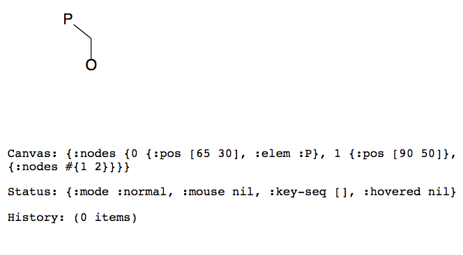

# molsketch-cljs

A 2D molecular structure drawing environment in ClojureScript.



## Setup

You will need Java and [Node.js](https://nodejs.org/) installed.

To run molsketch-cljs:

```bash
# Clone the repo
 git clone https://github.com/hessammehr/molsketch-cljs
 cd molsketch-cljs

# Install npm dependencies
 npm install

# Start the development server (with hot reload)
 npx shadow-cljs watch app
```

Then open your browser at [http://localhost:9500](http://localhost:9500).

## Keybindings
While hovering on a bond:
- **del**: Delete bond
- **1, 2, 3**: Make bond single, double, or triple

While hovering on an atom:
- **0**: Sprout a new atom
- **3, 4, 5, 6**: Graft a cyclopropyl, cyclobutyl, cyclopentyl, or cyclohexyl
ring at atom.
- **C, N, O, S, P**: Change atom element to C, N, etc.

## REPL fun
You can use a ClojureScript REPL with Shadow CLJS. For example, in another terminal:

```bash
npx shadow-cljs cljs-repl app
```

Then in the REPL:
```clojure
(require '[molsketch-cljs.core :as c])
(require '[molsketch-cljs.fragment.xformations :as x])
; Sprout an atom at node #1 (doesn't change the state)
(x/sprout-bond @(:canvas c/app-state) 1)
; Commit the change. The new atom will show up in your browser now.
(reset! (:canvas c/app-state) *1)
```

Pull requests are welcome! I have a few ideas listed below.

## Todo
* [X] Multiple bonds
* [ ] Custom atom labels
* [ ] Keeping track of implicit hydrogens
* [ ] Copy vector graphics to clipboard
* [ ] Read/write popular chemical structure formats
* [ ] Style support

## License

Copyright © 2015-2025 S. Hessam M. Mehr

MIT License
